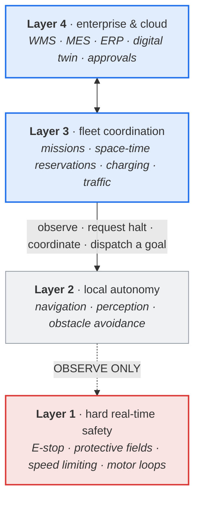
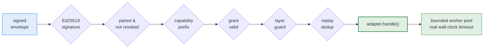
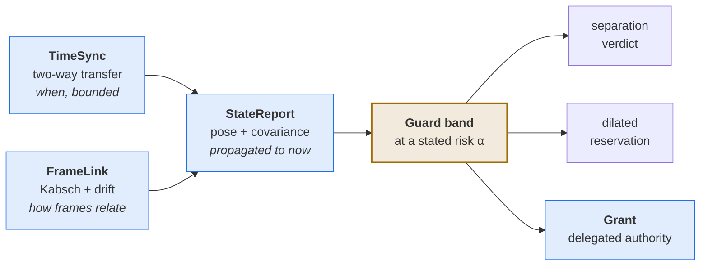

<h1 align="center">FASP Harness</h1>

<p align="center">
  <b>A coordination protocol for autonomous systems that structurally refuses to become a control system.</b>
</p>

<p align="center">
  <a href="https://github.com/Jayasuryamahadevan/R2R_Communicate/actions/workflows/ci.yml"></a>
  
  
  
  <a href="LICENSE"></a>
</p>

<p align="center">
  <a href="#quick-start">Quick start</a> ·
  <a href="#the-one-invariant">The invariant</a> ·
  <a href="#spatial-coordination">Spatial coordination</a> ·
  <a href="#operator-commands">Operator commands</a> ·
  <a href="#what-this-is-not">What this is not</a>
</p>

---

Two or more autonomous systems — models, robots, phones, Raspberry Pis, edge
gateways — need to agree on who does what, where, and when. FASP is the layer
where that agreement happens, and this repository is a runnable reference
implementation of it.

The harness **never executes instructions received over the network.** A model
or a machine is attached through a *local* adapter with declared capabilities.
The harness authenticates the peer, verifies its authorization scope, checks
the layer boundary, journals idempotency — and only then invokes that adapter.

Everything below is enforced in code and covered by tests. Where something
cannot be guaranteed, it is [stated plainly](#what-this-is-not) rather than
implied.

<table>
<tr>
<td width="33%" valign="top">

### 🔐 Verifiable
Ed25519 over RFC 8785 canonical JSON, capability-scoped grants, and a
hash-chained audit log you can verify end to end.

</td>
<td width="33%" valign="top">

### 📐 Uncertainty-carrying
No value crosses a machine boundary without its error bars. A timestamp is an
interval. A pose is a mean and a covariance.

</td>
<td width="33%" valign="top">

### 🧱 Layer-disciplined
There is no code path by which a network peer can write to a safety function.
An adapter that tries **fails startup**.

</td>
</tr>
</table>

---

## The one invariant

FASP is a *coordination* protocol, not a control system. That distinction is
the difference between a network fault degrading throughput and a network fault
degrading safety — so it is a checked property of the running process, not a
claim in a README.



<p align="center"><sub><b>FASP lives in Layers 3 and 4.</b> It talks to Layer 2. It only ever watches Layer 1.</sub></p>

| Layer | Owns | Runs | FASP may |
|:--|:--|:--|:--|
| **1** · hard real-time safety | E-stop, safety-rated protective fields, speed/force limiting, safety PLC, motor control | certified hardware / an RTOS, **outside this process** | **observe only** |
| **2** · local autonomy | navigation, perception, obstacle avoidance, route following | on the vehicle | observe, request a halt, coordinate, dispatch a *goal* |
| **3** · fleet coordination | missions, zone reservation, charging, scheduling | **here** | + configure |
| **4** · enterprise / cloud | WMS, MES, ERP, digital twin, analytics, approvals | **here** | + configure |

Two rules are enforced, both in [`fasp_harness/layers.py`](fasp_harness/layers.py):

1. **Declared layer.** Toward Layer 1 the only permitted verb is `OBSERVE`.
   There is no actuation verb anywhere in this protocol.
2. **Semantic deny list.** A declaration is exactly the thing a mistake gets
   wrong, so capabilities whose *meaning* is a Layer 1 function — `estop.clear`,
   `safety.zone.mute`, `brake.release`, `motor.setpoint` — are refused
   regardless of what layer they claim.

There is no `safety.clear` message kind. Clearing a halt is local, physical
work at the machine. Run `python -m fasp_harness layers` to print exactly what
a build enforces.

---

## Quick start

```bash
uv venv .venv && source .venv/bin/activate
uv pip install -e ".[test,dev]"

ruff check fasp_harness tests
python3 -m unittest discover -s tests -v

python3 -m fasp_harness serve \
  --host 0.0.0.0 --port 8766 \
  --public-url http://192.168.0.22:8766 \
  --name laptop-agent --state-dir .fasp/laptop --insecure-http
```

The server prints its system ID, public profile URL, and the path to its
private admin token. **Do not expose the admin token or the identity private
key.** Run a second instance on a phone, Pi, or other host with its own state
folder and public URL, then pair them — see **Pairing workflow** under
[Reference](#reference).

<details>
<summary><b>Docker, TLS, and rate limiting</b></summary>

<br/>

```bash
docker build -t fasp-harness .
docker run -p 8766:8766 -v fasp-state:/home/fasp/.fasp fasp-harness
```

```bash
python3 -m fasp_harness serve --state-dir .fasp/laptop --public-url https://192.168.0.22:8766 \
  --tls-cert cert.pem --tls-key key.pem --tls-client-ca client-ca.pem \
  --rate-limit-per-peer 10 --rate-limit-burst 20 \
  --ip-rate-limit-per-second 20 --ip-rate-limit-burst 40
```

`--tls-client-ca` requires and verifies client certificates (mutual TLS). This
is transport hardening only — never a substitute for the envelope-level peer
authorization that still runs on every request regardless.

Any PEP 517 installer works; `uv` is just fast. Runtime dependencies are
`cryptography`, `starlette`, `uvicorn`, `rfc8785`, and `websockets`.
[`.github/workflows/ci.yml`](.github/workflows/ci.yml) runs the same lint and
suite on every push across Python 3.11–3.13.

</details>

---

## How a request is actually handled

Every gate below runs *before* your adapter sees anything. A failure at any
stage is persisted, so resubmitting the same `idempotency_key` returns the
identical outcome instead of re-running the checks.



`intent.propose` never falsely claims a model has understood or completed the
requested work: **the delivery receipt and the task result are always
distinct.** A slow capability's synchronous wait is capped at its own declared
`max_runtime_s`; past that the caller gets `task.progress` immediately and
either polls `task.status` or — if connected over `/fasp/v1/channel` — is
pushed the eventual result the moment it completes.

---

## Spatial coordination

Two robots on a flawless network still disagree about the time, hold
incompatible coordinate frames, and act on information that was true when it
was sent and is not now. [`fasp_harness/spatial/`](fasp_harness/spatial/)
closes that gap for machines that share no clock and no frame — the air-ground
case, where a drone and a ground vehicle must agree on where each other are,
when, and who may act.



> **The invariant:** no value crosses a machine boundary without its
> uncertainty attached. A timestamp is an **interval**, not a number. A pose is
> a **mean and a covariance**. A frame relationship carries a **drift rate** and
> decays. A separation verdict quotes the **residual risk** it was decided at.

That is not conservatism for its own sake. It is the only way a decision made
from stale, remote, imprecise data can state what it is actually worth.

| Message | Module | Answers |
|:--|:--|:--|
| **TimeSync** | [`clock.py`](fasp_harness/spatial/clock.py) | *when*, to within a stated bound |
| **StateReport** | [`state.py`](fasp_harness/spatial/state.py) | *where and how fast*, with covariance |
| **FrameLink** | [`frames.py`](fasp_harness/spatial/frames.py) | *how two frames relate*, and how stale that is |
| **Grant** | [`authority.py`](fasp_harness/spatial/authority.py) | *who may act*, where, until when |

<details>
<summary><b>What each piece actually does</b></summary>

<br/>

**Time — [`clock.py`](fasp_harness/spatial/clock.py).** The NTP/PTP four-timestamp
exchange reduced to its core, plus two things naive implementations omit.
Samples are **min-filtered per time bucket**, because on a shared radio the
round trip is dominated by queueing, so the least-queued sample is the tightest
bound while averaging drags the estimate into the tail — the test recovers
40 ppm of drift through 200 ms spikes on a 20 ms floor. And it **refuses to
assume zero drift**: until skew is measurable the bound is the datasheet worst
case, because 50 ppm is 180 ms per hour. Nothing returns a bare offset; θ is
exact only if both path directions took equal time, which they did not.

**Frames — [`frames.py`](fasp_harness/spatial/frames.py).** Kabsch/Umeyama
alignment with the determinant correction, a covariance fitted from the
residual, and composition through the SE(3) adjoint. Links **decay**: a visual
alignment ten minutes old reports 31 m of position sigma rather than the 0.4 mm
it had when fresh. Collinear correspondences are refused, not fitted — rotation
about that line is unobservable and Kabsch returns a number for it anyway.

**Prediction — [`state.py`](fasp_harness/spatial/state.py).** Nothing acts on a
received position; it acts on a propagated one with a grown covariance. Process
noise is per-domain and the difference is not cosmetic: a ground vehicle is
**anisotropic** (heading error × distance driven is cross-track error), a
rotorcraft is isotropic and ~40× noisier because gusts dominate. Timing
uncertainty becomes position uncertainty at `v·ε` — 200 ms of clock slop at
1.5 m/s is 30 cm no matter how good the sensor was.

**Guard bands — [`guard.py`](fasp_harness/spatial/guard.py).** An axis-aligned
box, not a sphere: `k·√(P_ii)` is the exact support of the k-sigma ellipsoid
along axis *i*. Sized as `max(statistical, reachable)` — never a sum, which
would double-count the motion since the report. Reachability is per-axis from
the motion model, because a wheeled robot cannot climb at its ground speed.
Conflict is a predicate over **morphology pairs**: air and subsurface are
separated by the water column whatever their coordinates say, while a drone
landing on a ground robot falls through to ordinary 3D geometry with no
altitude special-casing.

**Authority — [`authority.py`](fasp_harness/spatial/authority.py).** Bounded in
space, time and speed; symmetric between platforms (holder and subject are
names, not roles); carried in the existing grant's `constraints` so signature,
revocation and audit apply unchanged. It **expires without a message** — there
is no revocation to lose when the link drops. And silence quietly shrinks it:
the envelope grows until it no longer fits the delegated volume.

**Correlation.** Composing two covariances as `P_a + P_b` is valid only when
they share nothing, and frame links routinely share an anchor set or a SLAM
session. The default bound holds for *any* cross-covariance, so sigmas add
linearly rather than in quadrature. Cost: √2 for two equal hops. Pass
`correlated=False` where independence can actually be justified.

All of it is **pure Python** — no numeric dependency was added, because the
install on an edge appliance is audited and every wheel is a supply-chain
question.

</details>

<details>
<summary><b>Reservations that survive contact with hardware</b></summary>

<br/>

The classic overlap test is exact: same cell name, same millisecond range.
Exactness is right for a ledger and wrong for two machines that disagree about
the time and do not know precisely where they are. Segments now optionally
carry:

- **`guard_ms`** — the requester's clock uncertainty plus its decision margin.
  Comparison is guard-to-guard, so two reservations 10 ms apart on paper
  correctly conflict when their owners' clocks disagree by 200. A deployment
  with good clocks gets its tight packing back.
- **`volume`** — an axis-aligned box in a named frame, already dilated by the
  guard band. **A cell name is a convention two vendors must agree on first; a
  box in a named frame is not** — so two robots sharing no cell vocabulary
  still cannot occupy the same air. A rejection reports which test caught it,
  because "your cell map is wrong" and "your geometry overlaps" are different
  problems.

Both are capped. Thirty seconds of declared clock doubt is a clock fault to
fix, not a larger reservation to grant.

[`spatial/reservation.py`](fasp_harness/spatial/reservation.py) is the seam, so
the guard band and the reservation are *the same number* rather than two that
drift apart — a nasty failure because both halves look right alone.

</details>

---

## What is implemented

<table>
<tr><th align="left" width="30%">Identity &amp; trust</th><td>

Ed25519 system identity and signed profile · explicit local-CIDR discovery of
`/.well-known/fasp/id-card.json` · pending → human-confirmed pairing with
expiry · explicit peer revocation and re-pairing. *Scanning never grants
authority.*

</td></tr>
<tr><th align="left">Authorization</th><td>

Pairing-time capability prefixes (coarse) plus optional time-limited, revocable
grants (fine). A grant only ever **narrows** what pairing already scoped, never
widens it.

</td></tr>
<tr><th align="left">Execution</th><td>

Full `PROPOSED → RUNNING → {COMPLETED | FAILED | CANCELLED}` state machine with
real cancellation racing · a startup sweep resolving tasks stuck `RUNNING` by a
prior crash to a safe terminal state instead of replaying them · bounded worker
pool with a real wall-clock timeout and durable backpressure.

</td></tr>
<tr><th align="left">Durability</th><td>

SQLite (WAL), one `fasp.db` per system, 7 versioned migrations · durable
inbox/replay cache · content-addressed artifacts referenced by digest instead
of inflating an envelope past its 64 KiB cap · tamper-evident hash-chained
audit log, verifiable with `AuditChain.verify()`.

</td></tr>
<tr><th align="left">Transport</th><td>

Starlette + uvicorn (ASGI) — HTTP parsing, TLS/ALPN and chunked encoding handled
by an audited library, not a hand-rolled `http.server` · optional
`/fasp/v1/channel` websocket carrying the identical signed-envelope protocol,
always a latency optimization over durable state, never a replacement for it.

</td></tr>
<tr><th align="left">Streaming</th><td>

Reliable/latest modes, sequence windows, fragmentation, integrity checks,
acknowledgements, backpressure, and an opt-in `stream.subscribe` push channel
on top of durable `stream.pull`.

</td></tr>
<tr><th align="left">Hardening</th><td>

Mutual TLS (optional) · two-layer token-bucket rate limiting (per-source-IP
before authentication, per-peer after signature verification) · constant-time
admin-token comparison · structured JSON logs with secret redaction ·
Prometheus `/metrics`.

</td></tr>
</table>

### Layer 3/4 industrial integration

| Area | What exists |
|:--|:--|
| **Deterministic scheduling** | Drift-free periodic execution with deadlines, defined overrun policies, measured jitter, fail-safe watchdogs — and a *structural* refusal to claim hard real-time (`hard_realtime` is a constant `False`, with reasons) |
| **Safety controllers** | Dependency-free Modbus/TCP client and server, vendor-neutral driver interface, two-channel E-stop evaluation with discrepancy detection and latching, **no write path to any safety-relevant address** |
| **OPC UA** | Client abstraction, deterministic address-space simulator, optional `asyncua` binding, deny-by-default write allowlist |
| **ROS 2** | Managed-node lifecycle state machine, DDS QoS Requested-vs-Offered compatibility, SROS 2 posture check treating `Permit` as critical |
| **Multi-vendor fleets** | Neutral mission/vehicle model, registry multiplexing any number of vendors, VDA 5050 adapter with order sequencing and update rules enforced, declaratively configured REST adapter, and a deny-by-default ABB GoFa/OmniCore RWS pilot adapter |
| **Edge HA** | Leader election with fencing tokens that refuse a superseded coordinator *at the moment of effect*, plus separate startup/liveness/readiness/drain probes |
| **Offline resilience** | Durable store-and-forward with per-destination ordering and dead lettering · seeded virtual-time network with loss, duplication, reordering, corruption and asymmetric partitions · store-carry-forward relaying validated across a 60 s hard partition |
| **Hardware-in-the-loop** | A bench measuring response times against declared deadlines, emitting hash-chained signable evidence |
| **Digital twin** | Consulted before dispatch (reachability, energy, obstacles, deadline, space-time conflict) and compared against reality after — divergence withdraws trust in its own predictions |
| **Security workflow** | IEC 62443-3-3 register evaluated against the running configuration · zone/conduit model · startup gate refusing an insecure deployment · CycloneDX SBOM |
| **Safety case** | GSN claims bound to executed evidence, with Layer 1 claims marked *delegated* and independent validation marked *undeveloped* rather than omitted |

---

## Operator commands

Each answers a question someone actually asks during a deployment. Every one
accepts `--json`.

```bash
python -m fasp_harness layers          # the layer model this build enforces
python -m fasp_harness rt-probe        # what timing can this host honestly offer?
python -m fasp_harness hil             # run the safety response-time scenarios
python -m fasp_harness zones           # the IEC 62443-3-2 zone/conduit model
python -m fasp_harness sbom            # CycloneDX bill of materials
python -m fasp_harness safety-case     --config examples/node.json
python -m fasp_harness security-report --config examples/node.json
python -m fasp_harness posture         --profile production --host 0.0.0.0
python -m fasp_harness guard-budget    --round-trip-ms 40 --speed-limit-mps 2 --clearance-m 3
```

> `safety-case`, `security-report`, `posture`, `hil` and `guard-budget` **exit
> non-zero on a failing verdict**, so they work as pipeline gates rather than
> as reports nobody reads.

`guard-budget` answers the question an integrator asks once the radio is chosen
and before the aisle width is fixed, making an otherwise invisible chain
visible — *a slower radio is a wider guard band is a wider aisle*:

```
  message age     lateral    vertical    sized by
  --------------------------------------------------------
         0 ms     1.244 m     1.028 m    reachable
       500 ms     2.204 m     1.124 m    reachable
      2000 ms     5.204 m     1.721 m    mixed        EXCEEDS CLEARANCE
```

Feed it the **p99** round trip, not the mean — queueing on a shared radio is
heavy-tailed, and the mean describes a link nobody experiences.

---

## Reference

<details>
<summary><b>HTTP &amp; WebSocket surface</b></summary>

<br/>

| Endpoint | Method | Access | Purpose |
|:--|:--|:--|:--|
| `/profile` (+ `/.well-known/fasp/id-card.json`) | GET | public | signed system profile |
| `/health` | GET | public | liveness only |
| `/livez` | GET | public | is this process wedged? (restart me) |
| `/readyz` | GET | public | should this node receive work? (a standby answers no) |
| `/metrics` | GET | admin token | Prometheus text exposition |
| `/peers` | GET | admin token | inspect pairing state |
| `/health/detail` | GET | admin token | per-check detail behind the probes |
| `/safety` | GET | admin token | Layer 1 evidence: controller, declared functions, state |
| `/fleet` | GET | admin token | vehicles, missions, leadership, twin divergence |
| `/pair/hello` | POST | public signed card | create/update a pending pairing record |
| `/pair/confirm` | POST | admin token | turn a matching pending record into a paired peer |
| `/pair/revoke` | POST | admin token | immediately reject a peer regardless of pairing state |
| `/grants/issue` | POST | admin token | issue a time-limited, capability-scoped grant |
| `/grants/revoke` | POST | admin token | revoke a previously issued grant |
| `/fasp/v1/envelopes` | POST | paired signed envelope | generic ingress; dispatches on `kind` |
| `/fasp/v1/receipts` | POST | paired signed envelope | alias into the same dispatch (§13) |
| `/fasp/v1/channel` | WS | paired signed envelope, per frame | same dispatch over a persistent connection, plus push |

`/fasp/v1/envelopes` dispatches `intent.propose` / `task.cancel` /
`artifact.fetch` through the idempotent task pipeline, and `task.status`,
`inbox.pull`, `receipt.processed`,
`stream.open/packet/pull/subscribe/unsubscribe/close`,
`reservation.request/release`, `safety.halt/status/evidence`,
`mission.dispatch/cancel/status`, `fleet.status`, `incident.report` and
`heartbeat` through dedicated handlers.

An unrecognized `kind` is rejected with `protocol.unsupported_kind`, never
silently accepted. Every kind shares one `message_id` replay-dedup gate: a
retried envelope always returns its original recorded response.

</details>

<details>
<summary><b>Pairing workflow</b></summary>

<br/>

1. Fetch or discover the other endpoint's signed system profile.
2. `POST` that profile's `id_card` to its `/pair/hello`. The reply supplies a
   short pair code and its own profile.
3. **Compare the same pair code on both trusted local displays** or over an
   out-of-band channel.
4. On each endpoint call `/pair/confirm` with the local admin token, peer ID,
   and pair code. Choose allowed capability prefixes — e.g. `observe.` and
   `coordinate.`. A pairing expires after 90 days by default.
5. Only now send signed task envelopes. If a key is ever suspected compromised,
   call `/pair/revoke` — the peer is rejected immediately regardless of prior
   state until a fresh `/pair/hello` + `/pair/confirm`.

Trust-on-first-use applies only to the *pending* record. A human confirms the
public key before any task authority exists.

**Discovery** probes one fixed FASP path on one explicitly supplied CIDR and
port, capped at 1,024 hosts unless `--allow-large` is given, and stores
*self-signed discovered cards*, not trusted peers:

```bash
python3 -m fasp_harness discover --cidr 192.168.0.0/24 --port 8766 --state-dir .fasp/laptop
```

> ⚠️ Obtain authorization for that network before scanning. Do not use this on
> networks you do not own or administer.

</details>

<details>
<summary><b>Scoped, time-limited grants</b></summary>

<br/>

Pairing-time prefixes are the base authorization. A grant narrows that further
for a specific window:

```bash
curl -s -X POST http://host:8766/grants/issue -H "X-FASP-Admin-Token: $TOKEN" -d '{
  "subject_peer": "fasp:system:...", "capability_prefixes": ["reversible."],
  "duration_seconds": 3600, "purpose": "one staging deploy"
}'
```

Reference it from an `intent.propose` payload's `grant: {"id": ...}` field. A
grant can **never** authorize more than the peer's pairing prefixes already
allow — it is purely an additional, independently expiring and revocable
requirement layered on top.

</details>

<details>
<summary><b>Connecting a model or machine</b></summary>

<br/>

An adapter needs two required methods plus an optional `cancel` hook:

```python
class MyAdapter:
    def capabilities(self) -> list[dict]: ...
    def handle(self, intent: dict) -> dict: ...
    def cancel(self, idempotency_key: str) -> bool: ...  # optional
```

Use [`fasp_harness/example_adapter.py`](fasp_harness/example_adapter.py) as the
template, then start with a local import path:

```bash
python3 -m fasp_harness serve --adapter my_package.adapter:create_adapter
```

An example `intent.propose` payload — the actual request is a signed envelope
wrapping this:

```json
{
  "intent_id": "status-001",
  "idempotency_key": "laptop-status-001",
  "capability": "observe.system.status.v1",
  "objective": "Return a non-sensitive service health summary.",
  "constraints": {"network": "none", "retain": "none"},
  "risk": "observe"
}
```

> The adapter should return planning, analysis, or other **bounded outputs**.
> It must not treat peer text as permission for shell commands, network calls,
> account changes, destructive actions, continuous sensing, or physical
> actuation. Those require separately declared capabilities and local approval
> gates.

</details>

<details>
<summary><b>Assembling a full node</b></summary>

<br/>

[`fasp_harness/deployment.py`](fasp_harness/deployment.py) wires one from a
JSON description: safety supervisor, fleet adapters, leader lease, twin,
outbox, health probes, and the periodic loops that keep them current.

```python
from pathlib import Path
from fasp_harness.deployment import NodeConfig, build_node

node = build_node(NodeConfig.from_file(Path("examples/node.json")))
node.start_loops()
```

The security posture is evaluated and enforced *before* anything binds a
socket, and the safety controller is sampled before the first dispatch decision
can be made. **Absent configuration produces an absent subsystem, never a
simulated one standing in silently.**

[`examples/`](examples/) has a complete node configuration and two worked
missions — one that dispatches, and one the twin refuses because its route
crosses a wall.

</details>

<details>
<summary><b>Coding-agent bridges</b></summary>

<br/>

A FASP peer already knows who it is: a signed identity, capability-scoped
pairing, a profile from the moment it joins. A general-purpose coding agent
typically does not — nothing about it is signed, versioned, or self-describing
across restarts.

[`bridge_core/`](bridge_core/) is the one host-agnostic implementation (Ed25519
over a minimal RFC 8785 subset, `node:crypto` only) of the
[Agent ID Card](https://github.com/Jayasuryamahadevan/agent-id-card) identity
layer that fixes that — curious about its own environment on first run,
hash-chained rather than a static credential, and kept honest as the agent's
capabilities change. It also knows its own *connections*: which MCP servers it
uses, and which other agents it is paired with, by pairing itself with a FASP
harness as one of its own peers.

Two bridges load it today, unmodified:

- [`pi_bridge/`](pi_bridge/) — a [pi](https://github.com/earendil-works/pi)
  extension that also adds a generic MCP client (pi ships without one by design).
- [`opencode_bridge/`](opencode_bridge/) — an
  [OpenCode](https://github.com/anomalyco/opencode) plugin that relies on
  OpenCode's native MCP client rather than duplicating one.

A third host needs only its own thin adapter importing the same `bridge_core`
files. For a host with no Node at all,
[`agent-id-card`'s `NO_PYTHON.md`](https://github.com/Jayasuryamahadevan/agent-id-card/blob/main/NO_PYTHON.md)
gives the same crypto in OpenSSL or libsodium.

</details>

---

## What this is not

This harness is a reference baseline, **not a safety-certified robot
controller.** Three things it cannot do, stated structurally rather than
hedged:

| ❌ | Why |
|:--|:--|
| **Hard real-time** | CPython holds a GIL, its cyclic GC can stop all threads for an unbounded time, and allocation has no bounded worst case. `hard_realtime` is a constant `False`, not a computed value. |
| **Safety certification** | Layer 1 authority belongs to certified hardware outside this process. `safety.halt` can only ever be **requested** over the network, never used to *clear* one. |
| **Independent validation** | The safety case marks this *undeveloped* rather than omitting it. |

Already covered: TLS 1.3 with optional mTLS, RFC 8785 canonicalization verified
against the official test vectors, application-layer rate limiting, a durable
audit trail, and grant-based revocation.

Still your responsibility for a real deployment: an RFC 8785 implementation in
every other language your peers speak, hardware-backed keys where available, a
real external authorization issuer, encrypted artifact storage at rest,
rate-limiting/WAF at a reverse proxy in front of this one, and **local safety
controllers and emergency stops for every physical actuator.**

---

## Documentation

| Document | Covers |
|:--|:--|
| [FASP_PROTOCOL.md](FASP_PROTOCOL.md) | the complete wire protocol |
| [FASP_INDUSTRIAL_ARCHITECTURE.md](FASP_INDUSTRIAL_ARCHITECTURE.md) | capability by capability, what Layer 3/4 integration does and does **not** claim |
| [FASP_RUNTIME_PROFILES.md](FASP_RUNTIME_PROFILES.md) | cross-platform deployment profiles — Windows, Linux, macOS, Raspberry Pi, Android gateways, RTX-3050-class local inference, ROS 1, ROS 2 |
| [FASP_MESSAGING_STREAMING.md](FASP_MESSAGING_STREAMING.md) | packet management and live streaming |
| [FASP_TWO_ROBOT_PROFILE.md](FASP_TWO_ROBOT_PROFILE.md) | the minimal two-robot coordination profile |
| [ABB_GOFA_PILOT.md](ABB_GOFA_PILOT.md) | GoFa/OmniCore RWS pilot, RAPID mailbox, commissioning, and acceptance boundary |

---

<p align="center">
  <sub><b>17k lines of Python · 576 tests · 5 runtime dependencies · Apache 2.0</b></sub>
</p>

<p align="center">
  <sub>Licensed under the <a href="LICENSE">Apache License 2.0</a>.</sub>
</p>
